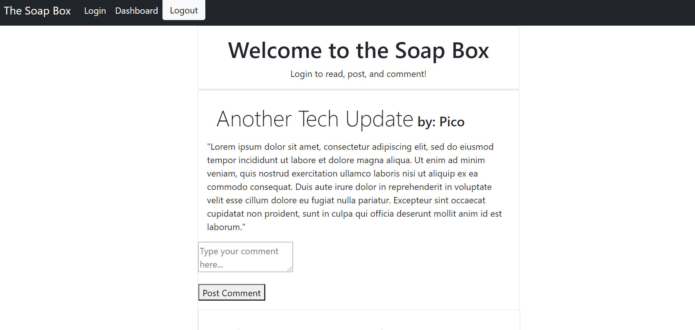

# soap-box-hero

## ABOUT

This is a wordpress style blog UI that utilizes MySQL, Sequelize, bcrypt, Express, and Handlebars. The database can be seeded directly from the commandline. Handlebars JS swaps views using three different partials. The signup and login forms are on the same view. There are tables for posts, comments, and users. I used Workbench to monitor my posts to the database, and Insomnia Core to check my GET and POST routes.

### SCREENSHOTS and SCREENCASTS

Sign Up, Login, and Post

