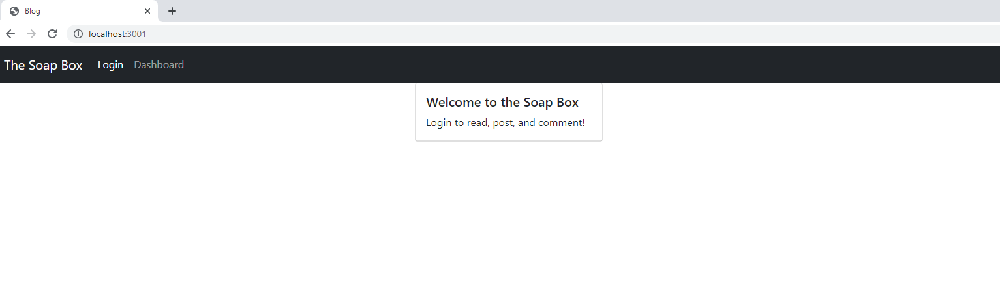
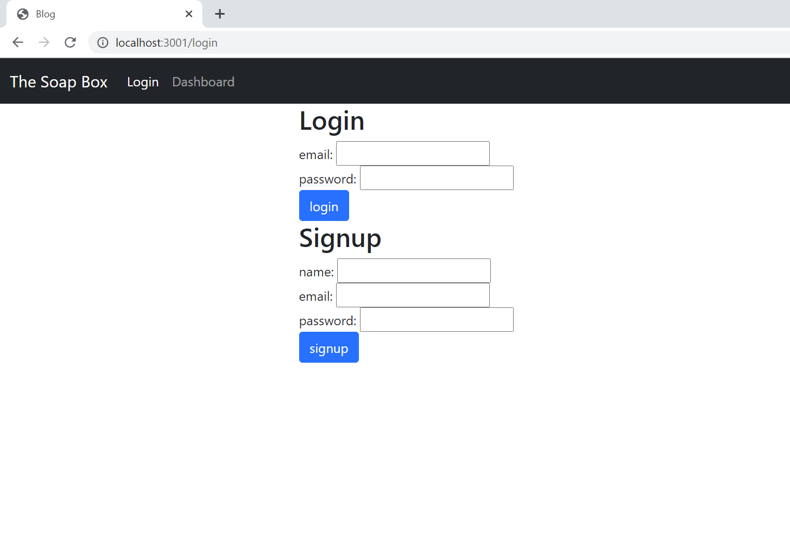

# soap-box-hero

## ABOUT

This is a wordpress style blog UI that utilizes MySQL, Sequelize, bcrypt, Express, and Handlebars. The database can be seeded directly from the commandline. Handlebars JS swaps views using three different partials. The signup and login forms are on the same view.

### SCREENSHOTS

